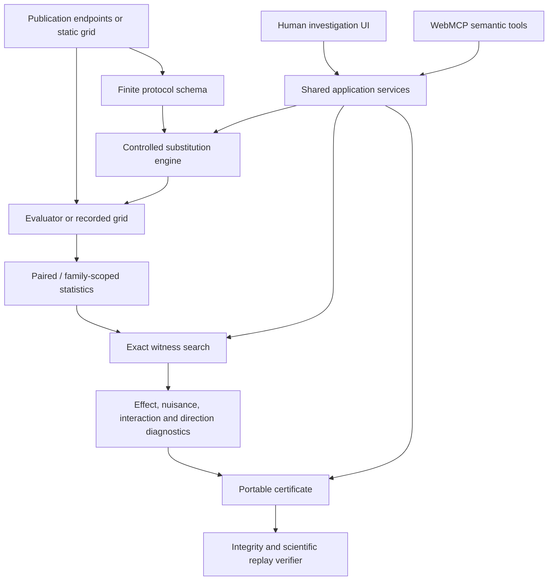

# Minimal Protocol Witness

MPW is a deterministic research system for reconciling conflicting model-evaluation conclusions by testing controlled protocol substitutions.

Two reports may evaluate the same models and benchmark yet disagree because prompting, reasoning budget, parsing, retries, tool access, scaffolding, or other harness choices differ. MPW represents those differences as a finite protocol space, evaluates counterfactual hybrids, and identifies every globally minimum exposed substitution sufficient to reproduce a target conclusion.

The result is **descriptive and conditional**. It is not automatically a causal explanation, a universal model ranking, or proof that either publisher is wrong.

## Research question

Let `Theta` be a finite protocol configuration space and let `C(theta)` be the evaluation conclusion produced under protocol `theta`.

For two source protocols `theta_A` and `theta_B` with different conclusions, define `H` as the coordinates on which the protocols differ. For any `S ⊆ H`, `theta_(A<-B,S)` starts from `theta_A` and substitutes exactly the values of `theta_B` on `S`.

A categorical A-to-B witness satisfies

```text
C(theta_(A<-B,S)) = C(theta_B).
```

The minimum-cardinality problem is

```text
minimize |S|
subject to C(theta_(A<-B,S)) = C(theta_B).
```

MPW returns **all** subsets attaining the global minimum. It distinguishes global minimum cardinality from mere inclusion minimality, and it computes A-to-B and B-to-A reconciliation separately because they can be asymmetric.

The full formulation, including empty witnesses, no-witness states, uncertainty, cost-sensitive variants, effect matching, and non-monotonicity, is in [`docs/RESEARCH_FORMALIZATION.md`](docs/RESEARCH_FORMALIZATION.md).

## What is implemented

### Generic finite protocol core

The research core supports arbitrary finite typed coordinates rather than embedding the canonical four dimensions in the search algorithm. Simulator-specific meaning remains outside the generic substitution and reconciliation modules.

Core modules:

```text
src/research/protocol.ts
src/research/search.ts
src/research/reconciliation.ts
```

### Exact search without a monotonicity assumption

Protocol sufficiency can be non-monotone: adding a change can move a conclusion away from the target or through `INCONCLUSIVE`. The default exact algorithms therefore do not silently prune supersets as if sufficiency were monotone.

Two proof levels are reported separately:

- `minimumProven`: no smaller sufficient subset exists;
- `coMinimumComplete`: every witness at the minimum cardinality was evaluated and returned;
- `landscapeExhaustive`: the entire endpoint-substitution powerset was evaluated.

Cardinality-ordered minimum search stops only after completing the first sufficient level. Full-landscape mode evaluates every subset.

[`docs/EXACT_SEARCH_QUERY_LOWER_BOUND.md`](docs/EXACT_SEARCH_QUERY_LOWER_BOUND.md) proves the black-box query requirement: under an arbitrary Boolean sufficiency map, proving a minimum of size `k` and returning all ties requires resolving every subset of size at most `k`; proving no witness exists requires all `2^|H|` subsets.

### Reconciliation benchmark

The project is not tested only on the canonical reasoning-budget example. The deterministic benchmark includes landscapes with:

- unique singleton witnesses;
- multiple co-minimum witnesses;
- minimum sizes two and three or greater;
- an empty witness;
- no exposed witness;
- source or target `INCONCLUSIVE`;
- non-monotone sufficiency;
- interactions;
- redundant and irrelevant coordinates;
- large nuisance effects;
- missing evidence;
- corrupted source declarations.

The benchmark checks exact recovery, all-tie recovery, unresolved states, deterministic behavior, candidate counts, certificate agreement, and independent-oracle agreement.

### Statistical methods

The canonical fixed-item analysis reports the paired accuracy difference `Delta = accuracy(A) - accuracy(B)` and uses a category-stratified paired nonparametric bootstrap. Each resample preserves declared stratum sizes and carries the two model outcomes for an item together.

That interval describes sensitivity to benchmark-item composition under the fixed evaluation artifact. It does not include repeated model-run, training, grader, or deployment variance.

The research branch also separates three distinct questions:

1. a pointwise interval for one fixed protocol;
2. synchronized simultaneous bootstrap bands for a predeclared finite protocol family;
3. robust target-reproduction probability under repeated stochastic evaluations.

The repeated-evaluation method uses simultaneous Bonferroni-Hoeffding lower bounds over the complete declared subset family. It deliberately fails to certify a high-probability witness when the repetition count is inadequate. It is implemented methodology, not evidence that the deterministic canonical witness is robust in real deployments.

See:

- [`docs/STATISTICAL_METHODS.md`](docs/STATISTICAL_METHODS.md)
- [`docs/ROBUST_WITNESS_METHOD.md`](docs/ROBUST_WITNESS_METHOD.md)

### Portable static protocol grids

A `StaticProtocolGridPackage` allows an external finite harness grid to be validated and reconciled without importing MPW's canonical simulator. It contains a typed protocol schema, two publication endpoints, every endpoint-substitution world, observations, limitations, canonical bytes, and a SHA-256 content identity.

Validation requires exactly `2^|H|` unique worlds and source declarations matching their endpoint rows. Hashing establishes content identity, not publisher authenticity or truth.

See [`docs/STATIC_PROTOCOL_GRID_PACKAGE.md`](docs/STATIC_PROTOCOL_GRID_PACKAGE.md) and [`schemas/static-protocol-grid-package-v1.schema.json`](schemas/static-protocol-grid-package-v1.schema.json).

### Replayable certificates

Certificate v2 separates two verification levels:

- **content-integrity validation** recomputes canonical bytes, the SHA-256 digest, and the artifact ID;
- **scientific replay validation** re-executes source declarations, the finite protocol landscape, witness minimality, all co-minimum witnesses, and the selected request against an expected evaluator and publication identities.

Certificates are directional and candidate-bound. The state layer cannot issue the canonical A-to-B certificate for an unrelated reverse-direction request.

Schema and implementation:

```text
schemas/reconciliation-certificate-v2.schema.json
src/research/certificate.ts
src/engine/mpwCanonicalCertificate.ts
scripts/verify-reconciliation-certificate.mts
```

A content hash is not a signature and does not authenticate a publisher.

### Shared human and agent services

The React interface and WebMCP tools call the same application services and deterministic engine. An agent chooses which experiments to run; it does not calculate statistics or certify its own answer.

The current semantic tool surface remains intentionally small:

```text
read_dispute
run_counterfactual
inspect_evidence
verify_witness
```

Source strings and evidence metadata are treated as untrusted data rather than instructions. Runtime schemas reject unknown properties and invalid coordinates. Experiment identities bind to immutable scientific inputs.

Actual browser/agent performance is a separate empirical question. Deterministic contracts and trace grading do not substitute for executed multi-agent trials.

## Evidence

### Canonical deterministic fixture

The tutorial fixture contains 400 synthetic items in four strata and two synthetic model profiles. Lab A and Lab B use different values for reasoning budget, answer parsing, retry policy, and tool access. The simulator produces item-level receipts from explicit model, item, and protocol mechanisms.

The fixture is designed for deterministic verification and adversarial tests. It makes no claim about real model capability.

### External harness-grid study

The generic reconciler was executed on five frozen candidates from an independently published harness-configuration grid associated with `arXiv:2608.21382`.

- all five contained a globally minimum cardinality-two witness under the declared categorical criterion;
- zero passed the stricter criterion requiring neither singleton to change the base conclusion.

The negative half is part of the result. This supports external applicability of the exact grid operation, not a claim of pure interaction effects or causal discovery.

See [`docs/EXTERNAL_FRAGILITY_GRID_RESULT.md`](docs/EXTERNAL_FRAGILITY_GRID_RESULT.md).

## Architecture



The canonical simulator is an adapter to this architecture, not the definition of the generic protocol engine.

## Verification status

| Claim | Status |
|---|---|
| Generic finite substitution and exact witness search are implemented | Verified by source inspection and automated tests |
| Canonical sources and all 16 worlds replay deterministically | Verified by execution in repository tests and certificate replay |
| Certificate request direction and candidate are bound | Verified by automated adversarial tests |
| Reconciliation benchmark covers varied known-ground-truth landscapes | Verified by execution |
| Exact-search black-box certificate bounds are implemented and tested | Verified by execution |
| External harness-grid workflow completed for five frozen candidates | Verified by recorded GitHub Actions execution |
| Independent third party reproduced the full project | Not yet verified |
| Final WebMCP behavior works across supported production browsers and agents | Not yet verified for the research branch |
| Real agents outperform DOM-only investigation | Not yet tested |
| Canonical witness is robust under repeated real model runs | Not established |
| MPW establishes causal responsibility | Not claimed |

## Reproduction

Requirements:

- Node.js 20 or later;
- the committed lockfile;
- no API key, database, GPU, or runtime model dependency for the deterministic research suite.

```bash
git clone https://github.com/tugrapaydiner/mpw.git
cd mpw
git checkout research/deep-mpw-overhaul
npm ci
npm run verify
```

Research workflows and scripts in `package.json` additionally exercise the reconciliation benchmark, family analysis, certificate generation, and certificate replay. Generated outputs are deterministic where their method explicitly declares a pinned seed.

## Repository guide

```text
src/engine/       canonical simulator, paired analysis, publications, adapters
src/research/     generic protocol, search, reconciliation, statistics, packages, certificates
src/state/        shared human/agent investigation state
src/webmcp/       semantic browser-agent tool contracts
tests/            unit, property, adversarial, benchmark, and integration checks
schemas/          versioned portable JSON Schemas
data/             deterministic fixtures and machine-readable study summaries
docs/             formalization, methods, landscape, audits, limitations, open questions
.github/workflows research, external-study, and independent-verification gates
```

## Limitations

The largest remaining limitations are empirical rather than cosmetic:

- most controlled ground truth is synthetic;
- the external study is small and grid-based;
- repeated real model runs are not yet available for robust-witness inference;
- live agent and browser evaluations remain pending;
- publisher authentication and attestations are separate from content hashing;
- protocol schemas can omit consequential dimensions;
- exact arbitrary non-monotone search is combinatorial;
- a categorical witness need not match the target effect magnitude;
- post-selection, benchmark-selection, and target-publication uncertainty require explicit study designs.

## Research landscape and open questions

The project does not claim to invent harness sensitivity, multiverse analysis, minimal counterfactual explanation, paired inference, exhaustive search, content-addressed artifacts, or tool-calling agents.

Its prospective contribution is the combination of:

- conflicting evaluation publications as the research object;
- semantic counterfactual protocol operations;
- exact global minimum and all-tie verification;
- explicit non-monotone search semantics;
- portable evidence and replay artifacts;
- one coherent human and browser-agent investigation workflow.

Conservative prior-art analysis is in [`docs/RESEARCH_LANDSCAPE.md`](docs/RESEARCH_LANDSCAPE.md). The highest-value unresolved problems are ranked in [`docs/OPEN_RESEARCH_QUESTIONS.md`](docs/OPEN_RESEARCH_QUESTIONS.md).

## Project status

This branch should be treated as a **serious research prototype**, not a publication-grade result. The formal and engineering foundation is substantially stronger than the original demonstration, but the next large gains require real repeated evaluations, broader external cases, controlled agent comparisons, and independent reproduction.

## License

MIT for repository source code. Third-party dependencies retain their own licenses; see [`docs/DEPENDENCIES_AND_LICENSES.md`](docs/DEPENDENCIES_AND_LICENSES.md).
