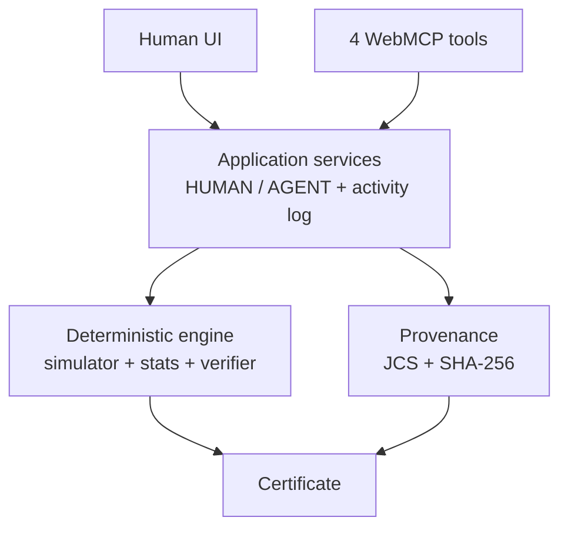

# Minimal Protocol Witness (mpw)

Two labs publish opposite conclusions from the same benchmark. An agent and a human
share one live page, run controlled protocol experiments, and converge on the smallest
change that reproduces the disagreement — verified by deterministic code, certified by hash.

**The demonstration model outputs are synthetic and deterministic. They are not claims
about real AI models.**

## Problem

Evaluation outcomes depend on harness and protocol choices — scaffold-only variation up
to 15 points on SWE-bench Verified (Epoch AI, 2026), harness-selected winners (fragility
grid, 2026), rank flips on every alignment benchmark tested (SafetyRepro, 2026). When two
published evaluations disagree, today's workflow is weeks of manual reimplementation with
no standard artifact. See `docs/IMPACT_AND_PRIOR_ART.md`.

## 15-second explanation

Same 400 synthetic items, same two models. Lab A says MODEL_A wins; Lab B says MODEL_B
wins. They differ in four protocol settings. The app lets you (or a browser agent) flip
each setting under controlled conditions until Lab B's conclusion reproduces — then
exhaustively proves which single change is the global minimum, and issues a content-hashed
certificate for it.

## Live demo

`https://tugrapaydiner.github.io/mpw/` (static HTTPS, no keys, no backend).

## Why WebMCP?

A static benchmark page exposes charts and conclusions. This application exposes semantic
experimental operations directly to the user's browser agent — `read_dispute`,
`run_counterfactual`, `inspect_evidence`, `verify_witness` — while the human and the
agent share the same live investigation state.

## Critical user journey

Read the dispute → run one-dimension hybrids → inspect the evidence → verify the
smallest reproducing set → receive the certificate. Any order works; nothing is forced.

## What the agent does

The agent chooses investigation actions: which dimensions to adopt, which experiment to
inspect, which candidate to verify. It decides nothing scientific — every conclusion,
minimum, and hash is computed by deterministic code and checked against it.

## What deterministic code does

The app code recomputes everything on every action: scores, 95% CIs, counterfactuals,
the global minimum witness, JCS canonical bytes, SHA-256 hashes, and the certificate —
and revalidates them on load. The LLM never calculates or certifies.

## Minimal Protocol Witness

### Mathematical definition

Fixed exposed set `D` (|D| = 4), base protocol θ_A (Lab A), target conclusion C(θ_B).
For `S ⊆ D`, hybrid θ_(A←B,S) starts from θ_A and replaces exactly the dims in `S`
with θ_B values. Item-level paired difference Δ(θ) = mean over items of (a − b).

Conclusion rule (CI-only, never the point estimate): MODEL_A iff ciLow > 0, MODEL_B
iff ciHigh < 0, else INCONCLUSIVE.

`S` is a sufficient witness iff C(θ_(A←B,S)) = C(θ_B). Global minimum cardinality =
min |S| over sufficient `S` (null if none). Minimum witnesses = ALL sufficient sets at
that cardinality; co-minimum witnesses = the same set (ties are never dropped; an
inclusion-minimal larger set is never substituted).

Conditional limitation: every witness is conditional on the exposed dims, fixture,
simulator/evaluator, scoring rule, uncertainty method, and conclusion rule. Change any
and the result is recomputed. This is descriptive sufficiency inside a fixture — not
causality, not universality, not fraud detection.

### Category-stratified paired bootstrap

10,000 replicates, seed `mpw-boot-v1`, mulberry32 PRNG. Each replicate resamples 100
items with replacement *within each of the four fixed strata* (100/category preserved)
and carries each item's paired (a, b) outcome together. CI = 2.5/97.5 percentiles.
Limitation: the interval measures benchmark-item resampling under fixed composition —
not repeated model runs, not universal model uncertainty.

### Synthetic simulator/fixture

400 items (4 strata × 100) with hashed per-item latents (difficulty, demand, fragility,
recoverability, tool need). Two model profiles (base, efficiency, reliability, retry,
tool). Per-item outcomes derive mechanistically from model × item × protocol properties
(budget normalization, parser acceptance, retry recovery, tool restriction) with
tuple-hashed draws (seed `mpw-canonical-v1`). 12,800 receipts regenerable via
`npm run fixtures`.

### Source-integrity checks

Each publication must reproduce its own headline at full precision (exact scores, CI,
conclusion, coverage, universe hash, versions) or the run raises
SOURCE_INTEGRITY_FAILURE. Canonical: Lab A MODEL_A (.8675/.7600, +.1075, [.055,.16]),
Lab B MODEL_B (.3150/.5250, −.2100, [−.2675,−.1525]), coverage 400/400.

### Counterfactual engine

`diffProtocols` derives the four differences; `constructHybrid` changes only selected
dims; every result is freshly simulated (no table lookups); experiment ids are content
hashes; order-free and repeat-stable.

### Global minimum verification

Bitmask powerset enumeration (all 16 subsets, past the early minimum), per-row
cardinality + experiment id + CI + sufficiency; INCONCLUSIVE targets and UNRESOLVED
outcomes supported; 20-dimension cap. Canonical result: minimum 1, unique witness
`{reasoning_budget}`.

### Provenance/certificate

JCS (RFC 8785) canonical bytes + pre-validation gate, SHA-256 over UTF-8, normalized
collections. Hashes prove content identity only. Finalized publication bundles carry
protocol/benchmark/evidence/manifest hashes under a nonrecursive boundary; the
Reconciliation Certificate (schema/format/engine/sim/stats/canon/hash versions,
dispute id, both sources, differences, target, full 16-row audit, witness experiment,
coverage 400/400/100, three limitations verbatim) hashes to its id. No clock inside.

## WebMCP tool surface

Exactly four top-level tools (`document.modelContext.registerTool`), same services as
the UI (caller AGENT): `read_dispute`, `run_counterfactual`, `inspect_evidence`,
`verify_witness`. Strict schemas, handler-side validation, eight coded errors,
readOnlyHint honestly set. Full contract: `docs/WEBMCP_TOOL_SPEC.md`.

## Architecture



## Agent evals

Protocol + pending trial table: `docs/AGENT_EVALS.md`. Deterministic trace grading
(`gradeTrace`) is automated; live-agent trials are human-run, none fabricated.

## Deterministic tests

192 tests in 30 files (`npm run verify` = typecheck + lint + tests + build): stats
proofs, forensic audits, formal MPW properties, mutation/tamper batteries, state
audits, injection battery, wording pins. Seeds pinned; rebuilds byte-identical.

## Reproducibility

`npm run fixtures && npm run bundles && npm run certificate` regenerates every
artifact with identical hashes. Reference investigation states:
`docs/ui-reference-states.json`.

## Limitations

Witnesses are conditional (six conditions above); bootstrap measures item resampling
only; synthetic models say nothing about real systems; hashes prove identity, not
truth; gallery collision check pending (gallery unpublished at write time).

## Impact

An applied instrument for the 2026 harness-awareness consensus: conflicting
evaluations in, agent-operable counterfactual search, verified minimum witness out.
Audience: evaluation researchers, benchmark designers, agent-interface builders.

## Related work

Harness-effect empirics (Epoch AI; Zhang et al. 2026; Harness-Bench; fragility grid;
SafetyRepro; GAIA scaffold study); multiverse / specification-curve methods (NeurIPS
2022; Simonsohn et al.; fairness multiverse); agent-native artifacts (Liu et al.,
ARA, 2026); NIST AI RMF MEASURE guidance. Details + differentiation in
`docs/IMPACT_AND_PRIOR_ART.md`. Adjacent concepts acknowledged; nothing here claims
first-ever.

## Local development

```sh
git clone https://github.com/tugrapaydiner/mpw.git
cd mpw
npm ci
npm run verify   # typecheck + lint + tests + build, must be green
npm run dev      # local dev server
npm start        # serve production dist locally
```

Regenerate artifacts: `npm run fixtures`, `npm run bundles`, `npm run certificate`.

## Deployment

Static Pages deploy from `main` (see `docs/DEPLOYMENT.md`). No env vars, no backend.

## License

MIT (`LICENSE`) for our source; third-party packages keep their own licenses
(`docs/DEPENDENCIES_AND_LICENSES.md`).
